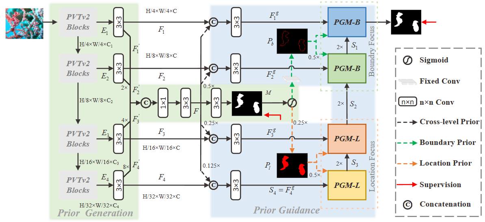
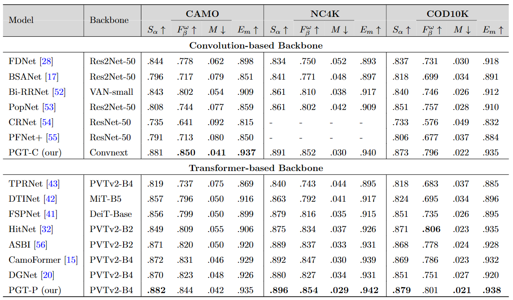
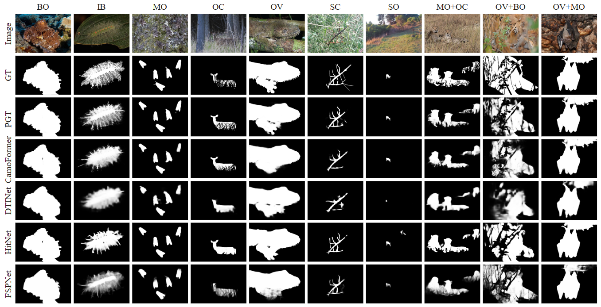

## Camouflaged Object Segmentation with Prior via Two-stage Training
This project provides the code and results for 'Camouflaged Object Segmentation with Prior via Two-stage Training'
> Authors:
> Rui Wang
> Caijuan Shi, 
> Changyu Duan,
> Weixiang Gao,
> Hongli Zhu, 
> Yunchao Wei

### Network Architecture

### Preparation
The training and testing experiments are conducted using PyTorch with a single GeForce RTX 1080Ti GPU of 12 GB Memory.
#### Configuring your environment:
* Creating a virtual environment : `conda create -n SINet python=3.9`
* Installing necessary packages: `pip install -r requirements.txt`
#### Downloading Training and Testing Sets
* Download train datasets (COD10K-train+CAMO-train): [TrainDatasets](https://github.com/lartpang/awesome-segmentation-saliency-dataset#camouflaged-object-detection-cod)
* Download test datasets (CAMO-test+COD10K-test-test+CHAMELEON+NC4K ):[TestDatasets](https://github.com/lartpang/awesome-segmentation-saliency-dataset#camouflaged-object-detection-cod)
#### Pretrained Backbone Model
* Download pretrained backbone model:[PVTv2-b4](https://drive.google.com/file/d/1SdfwxkvEKXoHz3YR-rpv535W9Vk5r3K2/view?usp=sharing), and put it in `./pth`
### Training 
* Modify the dataset path in `config.py --freeze=decoder`.
* First Training: run `python train.py`, and it generates catalogue `experiments\` with logs and weights.
* Second Training: run `python train.py --ckpt=last --freeze=backbone --thaw=backbone`
* You can also change the other config option by modify the `config.py`.
### Testing Configuration
* Testing: run `python test.py`, and the result maps are in `experiments\save_images\`.
* We provide CGTNet [testing maps](https://drive.google.com/drive/folders/1RjyYuv-Aq3UAre2uRdIKHOyABx9aplTX?usp=sharing) and [training weights](https://drive.google.com/file/d/1tDlF1AVkCuFIbGxbg4vU_IY9gEMp2ahs/view?usp=sharing) presented in the papers.
### Evaluation
* Tools: [PySODMetrics](https://github.com/lartpang/PySODMetrics) A simple and efficient implementation of SOD metrics.
### Results

### Credit
The code is partly based on [Camoformer](https://github.com/HVision-NKU/CamoFormer).

